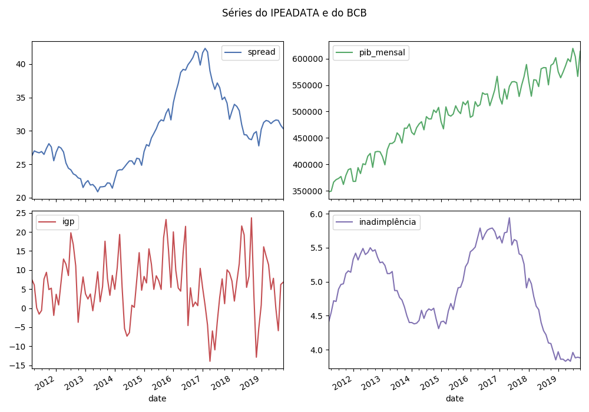

# SeriesBR: A Python package to get brazilian economic time series into a DataFrame


[](<https://travis-ci.org/phelipetls/seriesbr>) [](https://badge.fury.io/py/seriesbr)

<div id="table-of-contents">
<h2>Table of Contents</h2>
<div id="text-table-of-contents">
<ul>
<li><a href="#seriesbr-a-python-:session-package-to-get-brazilian-economic-time-series">1. SeriesBR: A Python package to get brazilian economic time series into a DataFrame</a>
<ul>
<li><a href="#sec-1-1">1.1. Introduction</a></li>
<li><a href="#sec-1-2">1.2. Installation</a></li>
<li><a href="#sec-1-3">1.3. Dependencies</a></li>
<li><a href="#sec-1-4">1.4. Main Features</a></li>
<li><a href="#banco-central-do-brasil">1.5. Banco Central do Brasil</a></li>
<li><a href="#instituto-de-pesquisa-econ-mica-aplicada">1.6. Instituto de Pesquisa Econômica Aplicada</a></li>
<li><a href="#sec-1-7">1.7. Conclusion</a></li>
<li><a href="#sec-1-8">1.8. License</a></li>
<li><a href="#sec-1-9">1.9. Support</a></li>
</ul>
</li>
</ul>
</div>
</div>

## Introduction

This package eases the task of getting data from Banco Central do Brasil
(BCB) and Instituto de Pesquisa Econômica Aplicada (Ipea) databases.

It has several function to interact with these databases through their API,
such as searching for a series by name or another criteria,
retrieving metadata and, most importantly,
getting the series values into a `pandas.DataFrame`.

It is heavily inspired by the R packages [rbcb](https://github.com/wilsonfreitas/rbcb) and [ipeaData](https://github.com/ipea/ipeaData).

## Installation

`pip3 install seriesbr`

## Dependencies

-   requests
-   pandas

## Main Features

-   Get multiple time series with `get_series`.
-   Search in a given database with `search`.
-   Get metadata with `get_metadata`.

## Banco Central do Brasil


Let's imagine you need to get the brazilian interest rate. You
will need the corresponding code but you have no idea what it is.

Not a problem, you can search for it like this:

```python
import pandas as pd
pd.set_option('display.max_rows', 10)

from seriesbr import bcb

bcb.search("Selic")
```

      codigo_sgs                                              title periodicidade                            unidade_medida
    0       1178          Taxa de juros - Selic anualizada base 252        diária                         Percentual ao ano
    1       4390             Taxa de juros - Selic acumulada no mês        mensal                         Percentual ao mês
    2       4189  Taxa de juros - Selic acumulada no mês anualiz...        mensal                         Percentual ao ano
    3       4177  Dívida mobiliária - Participação por indexador...        mensal                                Percentual
    4      10634  Dívida mobiliária federal (saldos) - Posição e...        mensal  Milhões de unidades monetárias correntes
    5             Estatísticas dos Sistemas de Liquidação de Tít...        Mensal                                          
    6             Negociação de Títulos Federais no Mercado Secu...                                                        
    7      10613  Dívida mobiliária federal - Títulos do Tesouro...        mensal                                     Meses
    8      10614  Dívida mobiliária federal - Títulos do Tesouro...        mensal                                     Meses
    9      10618  Dívida mobiliária federal - Títulos do Tesouro...        mensal                                     Meses

The `bcb.search` function takes an arbitrary number of optional arguments.

The API then do its best to give the results accordingly.

```python
bcb.search("Atividade", "Econômica", "Índice")
```

      codigo_sgs                                              title periodicidade              unidade_medida
    0      24364  Índice de Atividade Econômica do Banco Central...        mensal                      Índice
    1       7414       Vendas do setor supermercadista (Jan/94=100)        mensal                      Índice
    2      11426  Índice nacional de preços ao consumidor - Ampl...        mensal  Variação percentual mensal
    3      11427  Índice nacional de preços ao consumidor - Ampl...        mensal  Variação percentual mensal
    4      10841  Índice de Preços ao Consumidor-Amplo (IPCA) - ...        mensal  Variação percentual mensal
    5      10842  Índice de Preços ao Consumidor-Amplo (IPCA) - ...        mensal  Variação percentual mensal
    6      11428  Índice nacional de preços ao consumidor - Ampl...        mensal  Variação percentual mensal
    7      10843  Índice de Preços ao Consumidor-Amplo (IPCA) - ...        mensal  Variação percentual mensal
    8      10844  Índice de Preços ao Consumidor-Amplo (IPCA) - ...        mensal  Variação percentual mensal
    9      16122  Índice nacional de preços ao consumidor - Ampl...        mensal  Variação percentual mensal

By default, it only returns the first 10 results.
If you didn't find what you're looking for,
you can specify the number of returned results with `rows`
and how many results to skip with `skip`.

```python
bcb.search("Monetária", rows=20, skip=1)
```

       codigo_sgs                                              title periodicidade                                   unidade_medida
    0       17633  Recolhimentos obrigatórios de instituições fin...        mensal        Milhares de unidades monetárias correntes
    1        1849  Recolhimentos obrigatórios de instituições fin...        mensal        Milhares de unidades monetárias correntes
    2        1848  Recolhimentos obrigatórios de instituições fin...        mensal        Milhares de unidades monetárias correntes
    3        1850  Recolhimentos obrigatórios de instituições fin...        mensal        Milhares de unidades monetárias correntes
    4        1797  Recolhimentos obrigatórios de instituições fin...        mensal        Milhares de unidades monetárias correntes
    ..        ...                                                ...           ...                                              ...
    15      10813  Taxa de câmbio - Livre - Dólar americano (compra)        diária  Taxa unidade monetária corrente/dólar americano
    16          1  Taxa de câmbio - Livre - Dólar americano (vend...        diária  Taxa unidade monetária corrente/dólar americano
    17      12150  Saldos das operações de crédito das instituiçõ...        mensal         Milhões de unidades monetárias correntes
    18      12106  Saldos das operações de crédito das instituiçõ...        mensal         Milhões de unidades monetárias correntes
    19      17620  Insuficiência de direcionamento de crédito - D...        mensal        Milhares de unidades monetárias correntes
    
    [20 rows x 4 columns]

Ok, so now you know how to find out the desired code.
Let's get the actual values.

To get just one series, you would simply do:

```python
bcb.get_series({"Spread": 20786}) # or just 20786
```

                Spread
    date              
    2011-03-01   26.22
    2011-04-01   27.01
    2011-05-01   26.84
    2011-06-01   26.72
    2011-07-01   26.91
    ...            ...
    2019-06-01   31.43
    2019-07-01   31.63
    2019-08-01   31.57
    2019-09-01   30.84
    2019-10-01   30.35
    
    [104 rows x 1 columns]

But, in general, you will want to get multiple series.

The most convenient way to do that is to pass a dictionary
with keys being names and values being codes.

You can optionally specify the arguments `start` and `end` for the
initial and final date,  or `last_n` to get
just the last n observations.

```python
bcb.get_series({"Spread": 20786, "Selic": 4189, "PIB_Mensal": 4380}, start="2011", end="07-2012")
```

                Spread  Selic  PIB_Mensal
    date                                 
    2011-01-01     NaN  10.85    333330.5
    2011-02-01     NaN  11.17    335117.5
    2011-03-01   26.22  11.62    348082.9
    2011-04-01   27.01  11.74    349255.0
    2011-05-01   26.84  11.92    366411.2
    ...            ...    ...         ...
    2012-03-01   27.42   9.82    393868.0
    2012-04-01   26.84   9.35    382581.2
    2012-05-01   25.20   8.87    401072.7
    2012-06-01   24.42   8.39    399470.5
    2012-07-01   24.17   8.07    415385.2
    
    [19 rows x 3 columns]

If you don't mind the columns names, you can just feed it with the numbers.

```python
bcb.get_series(20786, 4189, 4380)
```

                20786  4189      4380 
    date                              
    1986-06-01    NaN  18.23       NaN
    1986-07-01    NaN  23.51       NaN
    1986-08-01    NaN  35.55       NaN
    1986-09-01    NaN  39.39       NaN
    1986-10-01    NaN  23.65       NaN
    ...           ...    ...       ...
    2019-07-01  31.63   6.40  619395.2
    2019-08-01  31.57   5.90  603944.8
    2019-09-01  30.84   5.71  566361.6
    2019-10-01  30.35   5.38  613627.6
    2019-11-01    NaN   4.90       NaN
    
    [402 rows x 3 columns]

You can get rid of the NaN's with the argument `join`,
which is passed to the [`pandas.concat`](https://pandas.pydata.org/pandas-docs/stable/reference/api/pandas.concat.html) function,
as well as any other keyword argument.

The default value for `join` is "outer". So, if you pass "inner":

```python
bcb.get_series(20786, 4189, 4380, join="inner")
```

                20786  4189      4380 
    date                              
    2011-03-01  26.22  11.62  348082.9
    2011-04-01  27.01  11.74  349255.0
    2011-05-01  26.84  11.92  366411.2
    2011-06-01  26.72  12.10  371046.4
    2011-07-01  26.91  12.25  373333.7
    ...           ...    ...       ...
    2019-06-01  31.43   6.40  594163.0
    2019-07-01  31.63   6.40  619395.2
    2019-08-01  31.57   5.90  603944.8
    2019-09-01  30.84   5.71  566361.6
    2019-10-01  30.35   5.38  613627.6
    
    [104 rows x 3 columns]

Or, of course, you can just call `dropna()` afterwards.

If you want more information about a given series, you can call `get_metadata`
and you will get a dictionary with the results.

```python
metadados = bcb.get_metadata(11)

metadados["notes"]
```

    Taxa de juros que representa a taxa média ajustada das operações compromissadas com prazo de um dia útil lastreadas com títulos públicos federais custodiados no Sistema Especial de Liquidação e de Custódia (Selic). Divulgação em % a.d.
    
    __Para mais informações sobre a série, clique no link abaixo:__
    
    https://www3.bcb.gov.br/sgspub/consultarmetadados/consultarMetadadosSeries.do?method=consultarMetadadosSeriesInternet&hdOidSerieSelecionada=11

## Instituto de Pesquisa Econômica Aplicada


Now let's check what we can do with the IPEA's database.

The `search` function here is more powerful because there are way more filters to play with.

For example, let's filter for a monthly macroeconomic time series with units in percent points.
Here, we have to specify which parameter we are referring to.

Under the hood, this functions asks the API to return any result
containing a given string in the specified field.

```python
from seriesbr import ipea

ipea.search(BASNOME="Macroeconômico", PERNOME="Mensal", UNINOME="(p.p.)")
```

                 SERCODIGO                                            SERNOME PERNOME UNINOME         BASNOME
    0         BM12_CRDSD12  Operações de crédito - recursos direcionados -...  Mensal  (p.p.)  Macroeconômico
    1       BM12_CRDSDPF12  Operações de crédito - recursos direcionados -...  Mensal  (p.p.)  Macroeconômico
    2       BM12_CRDSDPJ12  Operações de crédito - recursos direcionados -...  Mensal  (p.p.)  Macroeconômico
    3         BM12_CRLSD12    Operações de crédito - recursos livres - spread  Mensal  (p.p.)  Macroeconômico
    4       BM12_CRLSDPF12  Operações de crédito - recursos livres - sprea...  Mensal  (p.p.)  Macroeconômico
    ..                 ...                                                ...     ...     ...             ...
    10  VALOR12_GLOBAL2412               Bônus global República (24) - spread  Mensal  (p.p.)  Macroeconômico
    11  VALOR12_GLOBAL2712               Bônus global República (27) - spread  Mensal  (p.p.)  Macroeconômico
    12  VALOR12_GLOBAL4012               Bônus global República (40) - spread  Mensal  (p.p.)  Macroeconômico
    13   VALOR12_GLOBAL912                Bônus global República (9) - spread  Mensal  (p.p.)  Macroeconômico
    14   VALOR12_TJCBOND12                                    C-Bond - spread  Mensal  (p.p.)  Macroeconômico
    
    [15 rows x 5 columns]

Another example:

```python
ipea.search("Juros", PERNOME="Mensal", UNINOME="(% a.m.)")
```

                SERCODIGO                                            SERNOME PERNOME   UNINOME
    0   ANBIMA12_TJCDBP12                     Taxa de juros - CDB pré-fixado  Mensal  (% a.m.)
    1       BM12_TJCDBN12                                Taxa de juros - CDB  Mensal  (% a.m.)
    2        BM12_TJCDI12                         Taxa de juros - CDI / Over  Mensal  (% a.m.)
    3       BM12_TJLCMN12       Taxa de juros - letras de câmbio ao mutuário  Mensal  (% a.m.)
    4       BM12_TJLCTN12        Taxa de juros - letras de câmbio ao tomador  Mensal  (% a.m.)
    ..                ...                                                ...     ...       ...
    12       GM12_TJLFT12  Taxa de juros - Letras do Tesouro Nacional - f...  Mensal  (% a.m.)
    13   IBMEC12_OTNRTJ12  Taxa de juros - obrigações reajustáveis do Tes...  Mensal  (% a.m.)
    14    IBMEC12_TJEMP12  Taxa de juros paga pelo tomador do empréstimo ...  Mensal  (% a.m.)
    15     IBMEC12_TJLM12                Taxa de juros - letras imobiliárias  Mensal  (% a.m.)
    16    IBMEC12_TJTIT12                   Taxa de juros - letras de câmbio  Mensal  (% a.m.)
    
    [17 rows x 4 columns]

If you want to filter by theme ("TEMNOME") or by country ("PAINOME"), take a look at what is in
the database with `list_theme` and `list_countries`.

You could then get the series in the very same way:

```python
ipea.get_series({"Taxa de juros - Over / Selic": "BM12_TJOVER12", "Taxa de juros - CDB": "BM12_TJCDBN12"}, join="inner")
```

                Taxa de juros - Over / Selic  Taxa de juros - CDB
    date                                                         
    1974-01-01                          1.46             1.800000
    1974-02-01                          1.15             1.800000
    1974-03-01                          1.16             1.800000
    1974-04-01                          1.21             1.800000
    1974-05-01                          1.24             1.800000
    ...                                  ...                  ...
    2009-06-01                          0.76             0.711593
    2009-07-01                          0.79             0.776809
    2009-08-01                          0.69             0.692135
    2009-09-01                          0.69             0.718573
    2009-10-01                          0.69             0.693355
    
    [430 rows x 2 columns]

To get metadata you would do the same as in `bcb` module.

```python
metadados = ipea.get_metadata("BM12_TJOVER12")

metadados["SERCOMENTARIO"]
```

    'Quadro: Taxas de juros efetivas.  Para 1974-1979: fonte Andima.  Dados mais recentes atualizados pela Sinopse da Andima.  Obs.: A taxa Overnight / Selic é a média dos juros que o Governo paga aos bancos que lhe emprestaram dinheiro. Refere-se à média do mês. Serve de referência para outras taxas de juros do país. A taxa Selic é a taxa básica de juros da economia.'

## Conclusion

For your convenience there is also a module to get
series from both databases in a single call.

You will always get a `pandas.DataFrame` when calling
`get_series` in every module.

You don't have to worry about converting dates because the index
is already of type `datetime64[ns]` sou you can immediately enjoy
pandas functionalities regarding dates, such as slicing and plotting.

```python
from seriesbr import seriesbr

dados = seriesbr.get_series(
    {
        "spread": 20786,
        "pib_mensal": 4380,
        "igp": "PAN12_IGPDIG12",
        "inadimplência": "BM12_CRLIN12"
    },
    join="inner",
)

import matplotlib.pyplot as plt

dados.plot(subplots=True, layout=(2, 2))
plt.gcf().tight_layout()
plt.suptitle("Séries do IPEADATA e do BCB")
plt.subplots_adjust(top=.9)
plt.savefig('example.png', figsize=(7, 7))
```

<p align="center">

</p>

Hope you enjoy the package!!

If you find any bugs or if you think something could be better, 
feel free to open an issue / contribute by opening a pull request!

## License

[MIT](https://github.com/phelipetls/seriesbr/blob/master/LICENSE)

## Support

If you find it useful, consider giving the repository a star.
