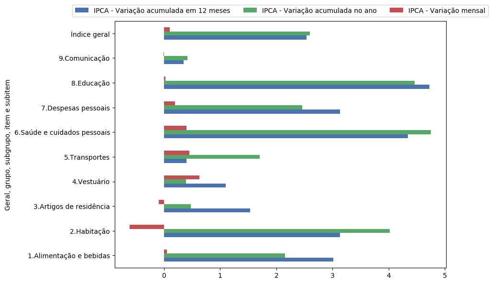

# SeriesBR: A Python package to get brazilian economic time series into a DataFrame


[\\](<https://travis-ci.org/phelipetls/seriesbr>)

<div id="table-of-contents">
<h2>Table of Contents</h2>
<div id="text-table-of-contents">
<ul>
<li><a href="#seriesbr-a-python-:session-package-to-get-brazilian-economic-time-series">1. SeriesBR: A Python package to get brazilian economic time series into a DataFrame</a>
<ul>
<li><a href="#sec-1-1">1.1. Introduction</a></li>
<li><a href="#sec-1-2">1.2. Installation</a></li>
<li><a href="#sec-1-3">1.3. Dependencies</a></li>
<li><a href="#sec-1-4">1.4. Main Features</a></li>
<li><a href="#banco-central-do-brasil">1.5. Banco Central do Brasil</a></li>
<li><a href="#instituto-de-pesquisa-econ-mica-aplicada">1.6. Instituto de Pesquisa Econômica Aplicada</a></li>
<li><a href="#sec-1-7">1.7. BCB + IPEA</a></li>
<li><a href="#sec-1-8">1.8. Instituto Brasileiro de Geografia e Estatística</a></li>
<li><a href="#sec-1-9">1.9. Conclusion</a></li>
<li><a href="#sec-1-10">1.10. License</a></li>
<li><a href="#sec-1-11">1.11. Support</a></li>
</ul>
</li>
</ul>
</div>
</div>

## Introduction

This package eases the task of getting data from Banco Central do Brasil
(BCB), Instituto de Pesquisa Econômica Aplicada (Ipea) and Instituto 
Brasileiro de Geografia e Estatística (IBGE) databases.

It has several functions to interact with these databases,
such as searching for a series by name or another criteria,
retrieving metadata and, most importantly,
getting the series values into a \`pandas.DataFrame\`.

It is heavily inspired by the R packages [rbcb](https://github.com/wilsonfreitas/rbcb), [ipeaData](https://github.com/ipea/ipeaData) and [sidrar](https://github.com/cran/sidrar).

## Installation

`pip3 install seriesbr`

## Dependencies

-   requests
-   pandas

## Main Features

-   Get multiple time series with `get_series`.
-   Search in a given database with `search`.
-   Get metadata with `get_metadata`.

## Banco Central do Brasil


Let's imagine you need to get the brazilian interest rate. You
will need a code for that but you have no idea what it is.

Not a problem, you can search for it like this:

```python
import pandas as pd
pd.set_option('display.max_rows', 10)

from seriesbr import bcb

bcb.search("Selic")
```

      codigo_sgs  ...                            unidade_medida
    0       1178  ...                         Percentual ao ano
    1       4390  ...                         Percentual ao mês
    2       4189  ...                         Percentual ao ano
    3       4177  ...                                Percentual
    4      10634  ...  Milhões de unidades monetárias correntes
    5             ...                                          
    6             ...                                          
    7      10613  ...                                     Meses
    8      10614  ...                                     Meses
    9      10618  ...                                     Meses
    
    [10 rows x 4 columns]

The `bcb.search` function takes an arbitrary number of optional arguments.

The API then do its best to give the results accordingly.

```python
bcb.search("Atividade", "Econômica", "Índice")
```

      codigo_sgs  ...              unidade_medida
    0      24364  ...                      Índice
    1       7414  ...                      Índice
    2      11426  ...  Variação percentual mensal
    3      11427  ...  Variação percentual mensal
    4      10841  ...  Variação percentual mensal
    5      10842  ...  Variação percentual mensal
    6      11428  ...  Variação percentual mensal
    7      10843  ...  Variação percentual mensal
    8      10844  ...  Variação percentual mensal
    9      16122  ...  Variação percentual mensal
    
    [10 rows x 4 columns]

By default, it only returns the first 10 results.
If you didn't find what you're looking for,
you can specify the number of returned results with `rows`
and how many results to skip with `skip`.

```python
bcb.search("Monetária", rows=20, skip=1)
```

       codigo_sgs  ...                                   unidade_medida
    0       17633  ...        Milhares de unidades monetárias correntes
    1        1849  ...        Milhares de unidades monetárias correntes
    2        1848  ...        Milhares de unidades monetárias correntes
    3        1850  ...        Milhares de unidades monetárias correntes
    4        1797  ...        Milhares de unidades monetárias correntes
    ..        ...  ...                                              ...
    15      10813  ...  Taxa unidade monetária corrente/dólar americano
    16          1  ...  Taxa unidade monetária corrente/dólar americano
    17      12150  ...         Milhões de unidades monetárias correntes
    18      12106  ...         Milhões de unidades monetárias correntes
    19      17620  ...        Milhares de unidades monetárias correntes
    
    [20 rows x 4 columns]

Ok, so now you know how to find out the desired code.
Let's get the actual values.

To get just one series, you would simply do:

```python
bcb.get_series({"Spread": 20786}) # or just 20786
```

                Spread
    date              
    2011-03-01   26.22
    2011-04-01   27.01
    2011-05-01   26.84
    2011-06-01   26.72
    2011-07-01   26.91
    ...            ...
    2019-06-01   31.43
    2019-07-01   31.63
    2019-08-01   31.57
    2019-09-01   30.84
    2019-10-01   30.35
    
    [104 rows x 1 columns]

But, in general, you will want to get multiple series.

The most convenient way to do that is to pass a dictionary
with keys being names and values being codes.

You can optionally specify the arguments `start` and `end` for the
initial and final date,  or `last_n` to get
just the last n observations.

```python
bcb.get_series({"Spread": 20786, "Selic": 4189, "PIB_Mensal": 4380}, start="2011", end="07-2012")
```

                Spread  Selic  PIB_Mensal
    date                                 
    2011-01-01     NaN  10.85    333330.5
    2011-02-01     NaN  11.17    335117.5
    2011-03-01   26.22  11.62    348082.9
    2011-04-01   27.01  11.74    349255.0
    2011-05-01   26.84  11.92    366411.2
    ...            ...    ...         ...
    2012-03-01   27.42   9.82    393868.0
    2012-04-01   26.84   9.35    382581.2
    2012-05-01   25.20   8.87    401072.7
    2012-06-01   24.42   8.39    399470.5
    2012-07-01   24.17   8.07    415385.2
    
    [19 rows x 3 columns]

If you don't mind the columns names, you can just feed it with the numbers.

```python
bcb.get_series(20786, 4189, 4380)
```

                20786  4189      4380 
    date                              
    1986-06-01    NaN  18.23       NaN
    1986-07-01    NaN  23.51       NaN
    1986-08-01    NaN  35.55       NaN
    1986-09-01    NaN  39.39       NaN
    1986-10-01    NaN  23.65       NaN
    ...           ...    ...       ...
    2019-07-01  31.63   6.40  619395.2
    2019-08-01  31.57   5.90  603944.8
    2019-09-01  30.84   5.71  566361.6
    2019-10-01  30.35   5.38  613627.6
    2019-11-01    NaN   4.90       NaN
    
    [402 rows x 3 columns]

You can get rid of the NaN's with the argument `join`,
which is passed to the [`pandas.concat`](https://pandas.pydata.org/pandas-docs/stable/reference/api/pandas.concat.html) function,
as well as any other keyword argument.

The default value for `join` is "outer". So, if you pass "inner":

```python
bcb.get_series(20786, 4189, 4380, join="inner")
```

                20786  4189      4380 
    date                              
    2011-03-01  26.22  11.62  348082.9
    2011-04-01  27.01  11.74  349255.0
    2011-05-01  26.84  11.92  366411.2
    2011-06-01  26.72  12.10  371046.4
    2011-07-01  26.91  12.25  373333.7
    ...           ...    ...       ...
    2019-06-01  31.43   6.40  594163.0
    2019-07-01  31.63   6.40  619395.2
    2019-08-01  31.57   5.90  603944.8
    2019-09-01  30.84   5.71  566361.6
    2019-10-01  30.35   5.38  613627.6
    
    [104 rows x 3 columns]

Or, of course, you can just call `dropna()` afterwards.

If you want more information about a given series, you can call `get_metadata`
and you will get a dictionary with the results.

```python
metadados = bcb.get_metadata(11)

metadados["notes"]
```

    Taxa de juros que representa a taxa média ajustada das operações compromissadas com prazo de um dia útil lastreadas com títulos públicos federais custodiados no Sistema Especial de Liquidação e de Custódia (Selic). Divulgação em % a.d.
    
    __Para mais informações sobre a série, clique no link abaixo:__
    
    https://www3.bcb.gov.br/sgspub/consultarmetadados/consultarMetadadosSeries.do?method=consultarMetadadosSeriesInternet&hdOidSerieSelecionada=11

## Instituto de Pesquisa Econômica Aplicada


Now let's check what we can do with the IPEA's database.

The `search` function here is more powerful because there are way more filters to play with.

For example, let's filter for a monthly macroeconomic time series with units in percent points.
Here, we have to specify which parameter we are referring to.

Under the hood, this functions asks the API to return any result
containing a given string in the specified field.

```python
from seriesbr import ipea

ipea.search(BASNOME="Macroeconômico", PERNOME="Mensal", UNINOME="(p.p.)")
```

                 SERCODIGO                                                                  SERNOME PERNOME UNINOME         BASNOME
    0         BM12_CRDSD12                    Operações de crédito - recursos direcionados - spread  Mensal  (p.p.)  Macroeconômico
    1       BM12_CRDSDPF12    Operações de crédito - recursos direcionados - spread - pessoa física  Mensal  (p.p.)  Macroeconômico
    2       BM12_CRDSDPJ12  Operações de crédito - recursos direcionados - spread - pessoa jurídica  Mensal  (p.p.)  Macroeconômico
    3         BM12_CRLSD12                          Operações de crédito - recursos livres - spread  Mensal  (p.p.)  Macroeconômico
    4       BM12_CRLSDPF12          Operações de crédito - recursos livres - spread - pessoa física  Mensal  (p.p.)  Macroeconômico
    ..                 ...                                                                      ...     ...     ...             ...
    10  VALOR12_GLOBAL2412                                     Bônus global República (24) - spread  Mensal  (p.p.)  Macroeconômico
    11  VALOR12_GLOBAL2712                                     Bônus global República (27) - spread  Mensal  (p.p.)  Macroeconômico
    12  VALOR12_GLOBAL4012                                     Bônus global República (40) - spread  Mensal  (p.p.)  Macroeconômico
    13   VALOR12_GLOBAL912                                      Bônus global República (9) - spread  Mensal  (p.p.)  Macroeconômico
    14   VALOR12_TJCBOND12                                                          C-Bond - spread  Mensal  (p.p.)  Macroeconômico
    
    [15 rows x 5 columns]

Another example:

```python
ipea.search("Juros", PERNOME="Mensal", UNINOME="(% a.m.)")
```

                SERCODIGO                                                           SERNOME PERNOME   UNINOME
    0   ANBIMA12_TJCDBP12                                    Taxa de juros - CDB pré-fixado  Mensal  (% a.m.)
    1       BM12_TJCDBN12                                               Taxa de juros - CDB  Mensal  (% a.m.)
    2        BM12_TJCDI12                                        Taxa de juros - CDI / Over  Mensal  (% a.m.)
    3       BM12_TJLCMN12                      Taxa de juros - letras de câmbio ao mutuário  Mensal  (% a.m.)
    4       BM12_TJLCTN12                       Taxa de juros - letras de câmbio ao tomador  Mensal  (% a.m.)
    ..                ...                                                               ...     ...       ...
    12       GM12_TJLFT12    Taxa de juros - Letras do Tesouro Nacional - financeiras (LFT)  Mensal  (% a.m.)
    13   IBMEC12_OTNRTJ12       Taxa de juros - obrigações reajustáveis do Tesouro Nacional  Mensal  (% a.m.)
    14    IBMEC12_TJEMP12  Taxa de juros paga pelo tomador do empréstimo por aceite cambial  Mensal  (% a.m.)
    15     IBMEC12_TJLM12                               Taxa de juros - letras imobiliárias  Mensal  (% a.m.)
    16    IBMEC12_TJTIT12                                  Taxa de juros - letras de câmbio  Mensal  (% a.m.)
    
    [17 rows x 4 columns]

If you want to filter by theme ("TEMNOME") or by country ("PAINOME"), take a look at what is in
the database with `list_theme` and `list_countries`.

You could then get the series in the very same way:

```python
ipea.get_series({"Taxa de juros - Over / Selic": "BM12_TJOVER12", "Taxa de juros - CDB": "BM12_TJCDBN12"}, join="inner")
```

                Taxa de juros - Over / Selic  Taxa de juros - CDB
    date                                                         
    1974-01-01                          1.46             1.800000
    1974-02-01                          1.15             1.800000
    1974-03-01                          1.16             1.800000
    1974-04-01                          1.21             1.800000
    1974-05-01                          1.24             1.800000
    ...                                  ...                  ...
    2009-06-01                          0.76             0.711593
    2009-07-01                          0.79             0.776809
    2009-08-01                          0.69             0.692135
    2009-09-01                          0.69             0.718573
    2009-10-01                          0.69             0.693355
    
    [430 rows x 2 columns]

To get metadata you would do the same as in `bcb` module.

```python
metadados = ipea.get_metadata("BM12_TJOVER12")

metadados["SERCOMENTARIO"]
```

    'Quadro: Taxas de juros efetivas.  Para 1974-1979: fonte Andima.  Dados mais recentes atualizados pela Sinopse da Andima.  Obs.: A taxa Overnight / Selic é a média dos juros que o Governo paga aos bancos que lhe emprestaram dinheiro. Refere-se à média do mês. Serve de referência para outras taxas de juros do país. A taxa Selic é a taxa básica de juros da economia.'

## BCB + IPEA

For your convenience there is also a module to get
series from both databases in a single call.

You will always get a `pandas.DataFrame` when calling
`get_series` in every module.

You don't have to worry about converting dates because the index
is already of type `datetime64[ns]` sou you can immediately enjoy
pandas functionalities regarding dates, such as slicing and plotting.

```python
from seriesbr import seriesbr

dados = seriesbr.get_series(
    {
        "spread": 20786,
        "pib_mensal": 4380,
        "igp": "PAN12_IGPDIG12",
        "inadimplência": "BM12_CRLIN12"
    },
    join="inner",
)

import matplotlib.pyplot as plt
import matplotlib

matplotlib.style.use('seaborn-deep')

dados.plot(subplots=True, layout=(2, 2), figsize=(10, 7))
plt.gcf().tight_layout()
plt.suptitle("Séries do IPEADATA e do BCB")
plt.subplots_adjust(top=.9)
```


Hope you enjoy the package!!

If you find any bugs or if you think something could be better, 
feel free to open an issue / contribute by opening a pull request!

## Instituto Brasileiro de Geografia e Estatística

IBGE has a very complex database, which allows you to get values for
very specific things. For example, some variables may have different
values for specific locations or categories.

Regarding locations, it could be a city, a state, a macroregion (Sul,
Sudeste), a microregion (for example, Lagos in Rio de Janeiro) or even a
mesoregion (e.g., Baixadas or Região Metropolitana in Rio).

The variables may also have different categories. For example, the IPCA
(Índice de Preços ao Consumidor Amplo) has values for very specific
products or kinds of products.

If you want such a detailed information, this package may be of help. It
has functions to help you get the codes for all of those things so you
can just pass them to the `get_series` later on.

To get a list of the locations, you can try `list_macroregions`, `list_states`,
 `list_cities`, `list_mesoregion` and `list_microregion`.

To search for an aggregated variable code, you would use `list_aggregates`.
To see which variables are associated with an aggregate, you'd use `list_variables`.

All list functions accepts two optional arguments `search` and
`where`, which is just a convenient way to search for a regex in a
given column ("nome" by default).

Also, you can get the metadata of a given aggregate with `get_metadata` function, which
will print a lot of text to the screen depending on the complexity of the aggregate.

To demonstrate how these come together in a typical workflow, let's recreate the first
chart in this [page](<https://sidra.ibge.gov.br/home/ipca>), a bar plot of the IPCA in October 2019 by products' category.

The aggregate used was "IPCA - Variação mensal, acumulada no ano e acumulada em 12 meses (%)",
let's search for its code.

```python
pd.set_option('max_colwidth', 200)

from seriesbr import ibge

ibge.list_aggregates("IPCA - Variação mensal, acumulada")
```

            id                                                                                                                                                                                       nome
    2243  2938                  IPCA - Variação mensal, acumulada no ano e peso mensal, para o índice geral, grupos, subgrupos, itens e subitens de produtos e serviços (de julho/2006 até dezembro/2011)
    2244  1419  IPCA - Variação mensal, acumulada no ano, acumulada em 12 meses e peso mensal, para o índice geral, grupos, subgrupos, itens e subitens de produtos e serviços (a partir de janeiro/2012)

After some reading, we will conclude that the code we need is 1419.

Let's see the variables of this aggregate.

    ibge.list_variables(1419)

         id                               variavel unidade
    0    63                 IPCA - Variação mensal       %
    1    69       IPCA - Variação acumulada no ano       %
    2  2265  IPCA - Variação acumulada em 12 meses       %
    3    66                     IPCA - Peso mensal       %

In the IBGE's chart, they used all of them except for IPCA - Peso mensal.
So, we will need to remember the codes 63, 69 and 66.

Now we need the code for the products categories,
which is a specific classification of this variable.
Let's use `list_classifications`.

I'll use a regex to get the exact categories used in the chart.
This isn't pretty, really, but does work.

```python
regex = "^\d\.(.ndice geral|Alimenta..o e bebidas|Habita.ao|Artigos de resid.ncia|Vestu.rio|Transportes|Sa.de e cuidados pessoais|Despesas pessoais|Educa..o|Comunica..o)$"

df = ibge.list_classifications(1419, regex)

df
```

           id                         nome unidade  nivel  classificacao_id                      classificacao_nome
    1    7170      1.Alimentação e bebidas    None     -1               315  Geral, grupo, subgrupo, item e subitem
    227  7486      3.Artigos de residência    None     -1               315  Geral, grupo, subgrupo, item e subitem
    270  7558                  4.Vestuário    None     -1               315  Geral, grupo, subgrupo, item e subitem
    315  7625                5.Transportes    None     -1               315  Geral, grupo, subgrupo, item e subitem
    348  7660  6.Saúde e cuidados pessoais    None     -1               315  Geral, grupo, subgrupo, item e subitem
    395  7712          7.Despesas pessoais    None     -1               315  Geral, grupo, subgrupo, item e subitem
    428  7766                   8.Educação    None     -1               315  Geral, grupo, subgrupo, item e subitem
    453  7786                9.Comunicação    None     -1               315  Geral, grupo, subgrupo, item e subitem

So, now  we have all that we need. Let's get the data first, we will `get_series` as usual.

```python
ids = df.id.to_list()

ipca = ibge.get_series(1419, variables=[63, 69, 2265], classifications={315: ids})

ipca
```

               Nível Territorial  Brasil           Mês  ... Geral, grupo, subgrupo, item e subitem Unidade de Medida Valor
    Data                                                ...                                                               
    2012-01-01            Brasil  Brasil  janeiro 2012  ...                1.Alimentação e bebidas                 %  0.86
    2012-01-01            Brasil  Brasil  janeiro 2012  ...                3.Artigos de residência                 %  0.16
    2012-01-01            Brasil  Brasil  janeiro 2012  ...                            4.Vestuário                 %  0.07
    2012-01-01            Brasil  Brasil  janeiro 2012  ...                          5.Transportes                 %  0.69
    2012-01-01            Brasil  Brasil  janeiro 2012  ...            6.Saúde e cuidados pessoais                 %  0.30
    ...                      ...     ...           ...  ...                                    ...               ...   ...
    2019-10-01            Brasil  Brasil  outubro 2019  ...                          5.Transportes                 %  0.40
    2019-10-01            Brasil  Brasil  outubro 2019  ...            6.Saúde e cuidados pessoais                 %  4.34
    2019-10-01            Brasil  Brasil  outubro 2019  ...                    7.Despesas pessoais                 %  3.13
    2019-10-01            Brasil  Brasil  outubro 2019  ...                             8.Educação                 %  4.72
    2019-10-01            Brasil  Brasil  outubro 2019  ...                          9.Comunicação                 %  0.35
    
    [2256 rows x 7 columns]

This is what will look like before any manipulation. It also
has parameters for dates (`start`, `end` and `last_n`.
But also for the locations (`city`, `state`, `macroregion`,
`microregion`, `mesoregion`). You will need to get the code for
a given location and pass them as a list if there is more than one,
or you can pass "all" and you'll get data for all of possible values
of that location.

Let's now do the manipulation needed to the plot.

```python
ipca["2019-10"].pivot_table(
    index="Geral, grupo, subgrupo, item e subitem", columns="Variável", values="Valor"
).plot(kind="barh", figsize=(10, 6)).legend(
    loc="upper center", ncol=3, bbox_to_anchor=(0.5, 1.08)
)

plt.tight_layout()
plt.savefig('ipca.png', bbox_inches="tight")
```
    


## Conclusion

Hope you enjoy the package!!

If you find any bugs or if you think something could be better, 
feel free to open an issue / contribute by opening a pull request!

## License

[MIT](https://github.com/phelipetls/seriesbr/blob/master/LICENSE)

## Support

If you find it useful, give this repo a start :)
