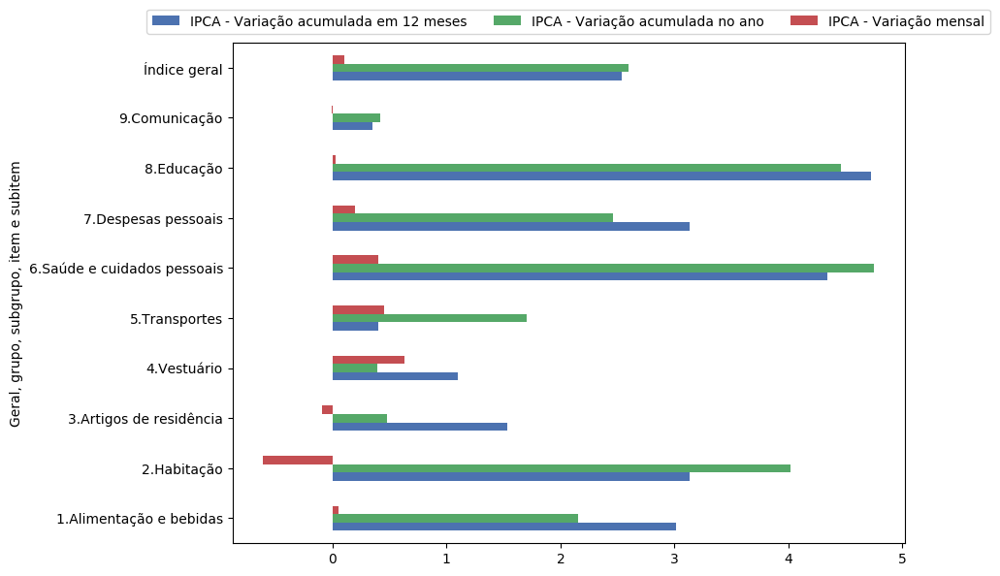
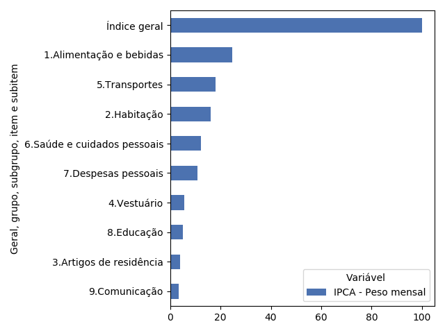
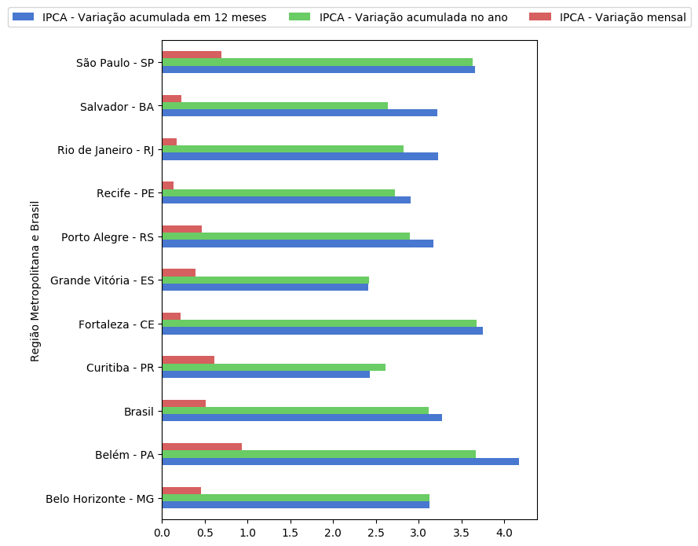
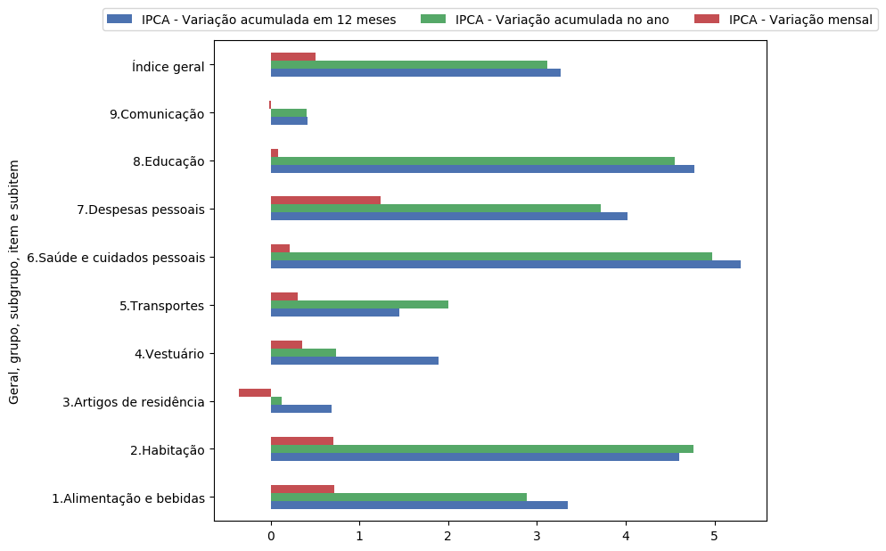
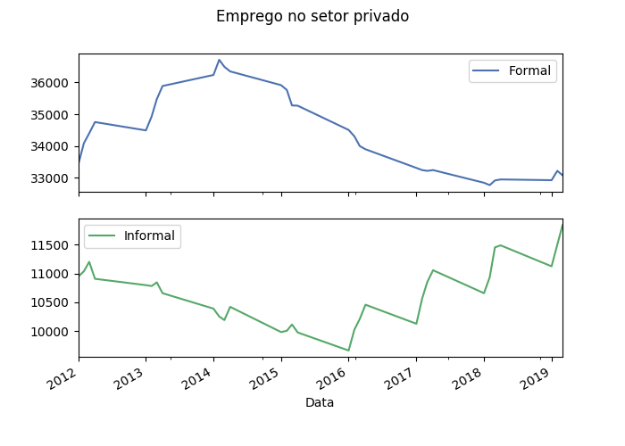

Instituto Brasileiro de Geografia e Estatística
===============================================

IBGE has a complex database.

It is composed of several researches responsibles for what they call
aggregate / aggregated variable.

An aggregate, in turn, has several variables, which can be another way
of measuring something or looking at a subject.

An aggregate can also have values for specific locations such as cities,
states, mesoregions, microregions etc. and different classifications.

For example, IPCA, the inflation rate, is an aggregate of the research
"Índice Nacional de Preços ao Consumidor Amplo", with variables such as
monthly and cumulative variation, among others. It has values for every
location of Brazil and for every many different kind of product or
service!

In this demonstration, we will try to replicate the visualizations as it
was done `here <https://sidra.ibge.gov.br/home/ipca/brasil>`__,
regarding the IPCA in oct/19.

Searching
---------

Let's first search for IPCA's code.

.. code:: python

   import pandas as pd
   from seriesbr import ibge

   pd.set_option('display.expand_frame_repr', False, 'display.max_colwidth', -1, 'display.max_rows', 10)

   ibge.search("Variação mensal, acumulada no ano, acumulada em 12 meses")

::

           id                                                                                                                                                                                           nome pesquisa_id                                     pesquisa_nome
   2231  1100  INPC - Variação mensal, acumulada no ano, acumulada em 12 meses e peso mensal, para o índice geral, grupos, subgrupos, itens e subitens de produtos e serviços (a partir de janeiro/2012)      PC          Índice Nacional de Preços ao Consumidor         
   2244  1419  IPCA - Variação mensal, acumulada no ano, acumulada em 12 meses e peso mensal, para o índice geral, grupos, subgrupos, itens e subitens de produtos e serviços (a partir de janeiro/2012)      IA          Índice Nacional de Preços ao Consumidor Amplo   
   2260  1705  IPCA15 - Variação mensal, acumulada no ano, acumulada em 12 meses e peso mensal, para o índice geral, grupos, subgrupos, itens e subitens de produtos e serviços (a partir de fevereiro/2012)  IQ          Índice Nacional de Preços ao Consumidor Amplo 15

If you want, it is also possible to search for all aggregates of a
research by assigning to the ``where`` parameter the value
"pesquisa\ :sub:`nome`".

Now let's take a look at the variables:

.. code:: python

   ibge.list_variables(1419)

::

        id                               variavel unidade
   0  63    IPCA - Variação mensal                 %     
   1  69    IPCA - Variação acumulada no ano       %     
   2  2265  IPCA - Variação acumulada em 12 meses  %     
   3  66    IPCA - Peso mensal                     %     

Now we want to know the code of the same classifications used by IBGE,
``list_classifications`` to the rescue.

All ``list_*`` functions takes an arbitrary number of strings (a regular
expression) as optional arguments to match the column "nome" by default,
i.e., the name of the categories in this case, but you can change this
with the argument ``where``.

So to search for the ones used in the IBGE's site we could do:

.. code:: python

   categories = ibge.list_classifications(
       1419,
       "Índice geral",
       "^..Alimentação e bebidas",
       "^..Habitação",
       "^..Artigos de residência",
       "^..Vestuário",
       "^..Transportes",
       "^..Saúde e cuidados pessoais",
       "^..Despesas Pessoais",
       "^..Educação",
       "^..Comunicação",
   )

   categories

::

          id                         nome unidade  nivel classificacao_id                      classificacao_nome
   0    7169  Índice geral                 None   -1      315              Geral, grupo, subgrupo, item e subitem
   1    7170  1.Alimentação e bebidas      None   -1      315              Geral, grupo, subgrupo, item e subitem
   191  7445  2.Habitação                  None   -1      315              Geral, grupo, subgrupo, item e subitem
   227  7486  3.Artigos de residência      None   -1      315              Geral, grupo, subgrupo, item e subitem
   270  7558  4.Vestuário                  None   -1      315              Geral, grupo, subgrupo, item e subitem
   315  7625  5.Transportes                None   -1      315              Geral, grupo, subgrupo, item e subitem
   348  7660  6.Saúde e cuidados pessoais  None   -1      315              Geral, grupo, subgrupo, item e subitem
   395  7712  7.Despesas pessoais          None   -1      315              Geral, grupo, subgrupo, item e subitem
   428  7766  8.Educação                   None   -1      315              Geral, grupo, subgrupo, item e subitem
   453  7786  9.Comunicação                None   -1      315              Geral, grupo, subgrupo, item e subitem

Getting time series
-------------------

Now let's use all this information we've gathered.

The aggregate is 1419, we will use every variable so no need to filter
that.

Since we have the both the codes for classifications and categories, we
can just pass a dictionary like this:
``{ classification: [ categories ] }``.

If you want to data for all values of a classification, pass its code as
an int / str or as a list if you want more than one.

.. code:: python

   ipca = ibge.get_series(1419, start="10-2019", end="10-2019", classifications={315: categories.id.to_list()})

   ipca

::

              Nível Territorial                Variável Geral, grupo, subgrupo, item e subitem    Valor
   Date                                                                                                
   2019-10-01  Brasil            IPCA - Variação mensal  Índice geral                           0.1000 
   2019-10-01  Brasil            IPCA - Variação mensal  1.Alimentação e bebidas                0.0500 
   2019-10-01  Brasil            IPCA - Variação mensal  2.Habitação                           -0.6100 
   2019-10-01  Brasil            IPCA - Variação mensal  3.Artigos de residência               -0.0900 
   2019-10-01  Brasil            IPCA - Variação mensal  4.Vestuário                            0.6300 
   ...            ...                               ...                      ...                   ... 
   2019-10-01  Brasil            IPCA - Peso mensal      5.Transportes                          18.1478
   2019-10-01  Brasil            IPCA - Peso mensal      6.Saúde e cuidados pessoais            12.2823
   2019-10-01  Brasil            IPCA - Peso mensal      7.Despesas pessoais                    10.8677
   2019-10-01  Brasil            IPCA - Peso mensal      8.Educação                             5.0180 
   2019-10-01  Brasil            IPCA - Peso mensal      9.Comunicação                          3.4434 

   [40 rows x 4 columns]

Now let's visualize the inflation rate by product / service.

.. code:: python

   ipca.pivot_table(index="Geral, grupo, subgrupo, item e subitem", columns="Variável", values="Valor")

::

   Variável                                IPCA - Peso mensal  IPCA - Variação acumulada em 12 meses  IPCA - Variação acumulada no ano  IPCA - Variação mensal
   Geral, grupo, subgrupo, item e subitem                                                                                                                     
   1.Alimentação e bebidas                 24.5278             3.01                                   2.15                              0.05                  
   2.Habitação                             16.1701             3.13                                   4.02                             -0.61                  
   3.Artigos de residência                 3.9050              1.53                                   0.48                             -0.09                  
   4.Vestuário                             5.6379              1.10                                   0.39                              0.63                  
   5.Transportes                           18.1478             0.40                                   1.70                              0.45                  
   6.Saúde e cuidados pessoais             12.2823             4.34                                   4.75                              0.40                  
   7.Despesas pessoais                     10.8677             3.13                                   2.46                              0.20                  
   8.Educação                              5.0180              4.72                                   4.46                              0.03                  
   9.Comunicação                           3.4434              0.35                                   0.42                             -0.01                  
   Índice geral                            100.0000            2.54                                   2.60                              0.10                  

.. code:: python

   import matplotlib
   import matplotlib.pyplot as plt

   matplotlib.style.use('seaborn-muted')

   ipca.pivot_table(
       index="Geral, grupo, subgrupo, item e subitem", columns="Variável", values="Valor"
   ).drop("IPCA - Peso mensal", axis="columns").plot(kind="barh", figsize=(10, 6)).legend(
       loc="upper center", ncol=3, bbox_to_anchor=(0.5, 1.08)
   )

   plt.tight_layout()
   plt.savefig('imgs/ipca.png', bbox_inches="tight")

   'imgs/ipca.png'

|image0|

To see the weight of each product in the inflation rate:

.. code:: python

   ipca.pivot_table(
       index="Geral, grupo, subgrupo, item e subitem", columns="Variável", values="Valor"
   ).loc[:, ["IPCA - Peso mensal"]].sort_values("IPCA - Peso mensal").plot(kind="barh")

   plt.tight_layout()
   plt.savefig('imgs/peso_mensal.png')

   'imgs/peso_mensal.png'

|image1|

It would be great if we could plot the inflation rate by metropolitan
area, a mesoregion.

Apart from mesoregions, there are also macroregions (Sul, Sudeste),
microregions (Baixadas, Norte Fluminense etc. in Rio de Janeiro), cities
and states.

If this location is available for an aggregate, you can assign "all" and
it will do return data for every location, but you can pass a list of
codes or a single code to select specific locations.

By default, it will get data for the whole country. If you want data for
other regions and also for Brazil as a whole, you can do the following:

.. code:: python

   ipca_by_area = ibge.get_series(1419, mesoregion=True, brazil="yes", start="10-2019", end="10-2019")

   ipca_by_area

::

                  Nível Territorial Região Metropolitana e Brasil                               Variável Geral, grupo, subgrupo, item e subitem   Valor
   Date                                                                                                                                                
   2019-10-01  Região Metropolitana  Belém - PA                    IPCA - Variação mensal                 Índice geral                           0.22  
   2019-10-01  Região Metropolitana  Belém - PA                    IPCA - Variação acumulada no ano       Índice geral                           2.71  
   2019-10-01  Região Metropolitana  Belém - PA                    IPCA - Variação acumulada em 12 meses  Índice geral                           3.21  
   2019-10-01  Região Metropolitana  Belém - PA                    IPCA - Peso mensal                     Índice geral                           100.00
   2019-10-01  Região Metropolitana  Fortaleza - CE                IPCA - Variação mensal                 Índice geral                           0.04  
   ...                          ...         ...                                   ...                              ...                              ...
   2019-10-01  Região Metropolitana  Porto Alegre - RS             IPCA - Peso mensal                     Índice geral                           100.00
   2019-10-01  Brasil                Brasil                        IPCA - Variação mensal                 Índice geral                           0.10  
   2019-10-01  Brasil                Brasil                        IPCA - Variação acumulada no ano       Índice geral                           2.60  
   2019-10-01  Brasil                Brasil                        IPCA - Variação acumulada em 12 meses  Índice geral                           2.54  
   2019-10-01  Brasil                Brasil                        IPCA - Peso mensal                     Índice geral                           100.00

   [44 rows x 5 columns]

To be clear, if you want data for all vales of a given location, just
pass anything that would be evaluated as ``True`` in Python.

.. code:: python

   ipca_by_area.pivot_table(
       index="Região Metropolitana e Brasil", columns="Variável", values="Valor"
   ).drop("IPCA - Peso mensal", axis="columns").plot.barh(figsize=(8, 7)).legend(
       loc="upper center", ncol=3, bbox_to_anchor=(0.5, 1.08)
   )

   plt.tight_layout()
   plt.savefig('imgs/ipca_by_area.png', bbox_inches="tight")
   'imgs/ipca_by_area.png'

|image2|

Let's take advantage of the ``last_n`` keyword argument to take a look
at the most recent inflation rate by product:

.. code:: python

   ibge.get_series(
       1419, classifications={315: categories.id.to_list()}, last_n=1
   ).pivot_table(
       index="Geral, grupo, subgrupo, item e subitem", columns="Variável", values="Valor"
   ).drop("IPCA - Peso mensal", axis="columns").plot.barh(figsize=(8, 7)).legend(
       loc="upper center", ncol=3, bbox_to_anchor=(0.5, 1.08)
   )

   plt.savefig('imgs/recent_ipca.png', bbox_inches='tight')
   'imgs/recent_ipca.png'

|image3|

Getting metadata
----------------

.. code:: python

   ibge.get_metadata(1419)

::

                                                                                                                                                                                                                                                                                                                                                                                                                                                                                                                                                                                                                                                                                                                                                                                                                                                                                                                                                                                                                                                                                                                                                                                                                                                                                                                                                                                                                                                                                                                                                                                                                                                                                                                                                                                                                                                                                                                                                                                                                                                                                                                                                                                                                                                                                                                                                                                                                                                                                                                                                                                                                                                                                                                                                                                                                                                                                                                                                                                                                                                                                                                                                                                                                                                                                                                                                                                                                                                                                                                                                                                                                                                                                                                                                                                                                                                                                                                                                                                                                                                                                                                                                                                                                                                                                                                                                                                                                                                                                                                                                                                                                                                                                                                                                                                                                                                                                                                                                                                                                                                                                                                                                                                                                                                                                                                                                                                                                                                                                                                                                                                                                                                                                                                                                                                                                                                                                                                                                                                                                                                                                                                                                                                                                                                                                                                                                                                                                                                                                                                                                                                                                                                                                                                                                                                                                                                                                                                                                                                                                                                                                                                                                                                                                                                                                                                                                                                                                                                                                                                                                                                                                                                                                                                                                                                                                                                                                                                                                                                                                                                                                 values
   id                1419                                                                                                                                                                                                                                                                                                                                                                                                                                                                                                                                                                                                                                                                                                                                                                                                                                                                                                                                                                                                                                                                                                                                                                                                                                                                                                                                                                                                                                                                                                                                                                                                                                                                                                                                                                                                                                                                                                                                                                                                                                                                                                                                                                                                                                                                                                                                                                                                                                                                                                                                                                                                                                                                                                                                                                                                                                                                                                                                                                                                                                                                                                                                                                                                                                                                                                                                                                                                                                                                                                                                                                                                                                                                                                                                                                                                                                                                                                                                                                                                                                                                                                                                                                                                                                                                                                                                                                                                                                                                                                                                                                                                                                                                                                                                                                                                                                                                                                                                                                                                                                                                                                                                                                                                                                                                                                                                                                                                                                                                                                                                                                                                                                                                                                                                                                                                                                                                                                                                                                                                                                                                                                                                                                                                                                                                                                                                                                                                                                                                                                                                                                                                                                                                                                                                                                                                                                                                                                                                                                                                                                                                                                                                                                                                                                                                                                                                                                                                                                                                                                                                                                                                                                                                                                                                                                                                                                                                                                                                                                                                                                                              
   nome              IPCA - Variação mensal, acumulada no ano, acumulada em 12 meses e peso mensal, para o índice geral, grupos, subgrupos, itens e subitens de produtos e serviços (a partir de janeiro/2012)                                                                                                                                                                                                                                                                                                                                                                                                                                                                                                                                                                                                                                                                                                                                                                                                                                                                                                                                                                                                                                                                                                                                                                                                                                                                                                                                                                                                                                                                                                                                                                                                                                                                                                                                                                                                                                                                                                                                                                                                                                                                                                                                                                                                                                                                                                                                                                                                                                                                                                                                                                                                                                                                                                                                                                                                                                                                                                                                                                                                                                                                                                                                                                                                                                                                                                                                                                                                                                                                                                                                                                                                                                                                                                                                                                                                                                                                                                                                                                                                                                                                                                                                                                                                                                                                                                                                                                                                                                                                                                                                                                                                                                                                                                                                                                                                                                                                                                                                                                                                                                                                                                                                                                                                                                                                                                                                                                                                                                                                                                                                                                                                                                                                                                                                                                                                                                                                                                                                                                                                                                                                                                                                                                                                                                                                                                                                                                                                                                                                                                                                                                                                                                                                                                                                                                                                                                                                                                                                                                                                                                                                                                                                                                                                                                                                                                                                                                                                                                                                                                                                                                                                                                                                                                                                                                                                                                                                         
   URL               http://sidra.ibge.gov.br/tabela/1419                                                                                                                                                                                                                                                                                                                                                                                                                                                                                                                                                                                                                                                                                                                                                                                                                                                                                                                                                                                                                                                                                                                                                                                                                                                                                                                                                                                                                                                                                                                                                                                                                                                                                                                                                                                                                                                                                                                                                                                                                                                                                                                                                                                                                                                                                                                                                                                                                                                                                                                                                                                                                                                                                                                                                                                                                                                                                                                                                                                                                                                                                                                                                                                                                                                                                                                                                                                                                                                                                                                                                                                                                                                                                                                                                                                                                                                                                                                                                                                                                                                                                                                                                                                                                                                                                                                                                                                                                                                                                                                                                                                                                                                                                                                                                                                                                                                                                                                                                                                                                                                                                                                                                                                                                                                                                                                                                                                                                                                                                                                                                                                                                                                                                                                                                                                                                                                                                                                                                                                                                                                                                                                                                                                                                                                                                                                                                                                                                                                                                                                                                                                                                                                                                                                                                                                                                                                                                                                                                                                                                                                                                                                                                                                                                                                                                                                                                                                                                                                                                                                                                                                                                                                                                                                                                                                                                                                                                                                                                                                                                              
   pesquisa          Índice Nacional de Preços ao Consumidor Amplo                                                                                                                                                                                                                                                                                                                                                                                                                                                                                                                                                                                                                                                                                                                                                                                                                                                                                                                                                                                                                                                                                                                                                                                                                                                                                                                                                                                                                                                                                                                                                                                                                                                                                                                                                                                                                                                                                                                                                                                                                                                                                                                                                                                                                                                                                                                                                                                                                                                                                                                                                                                                                                                                                                                                                                                                                                                                                                                                                                                                                                                                                                                                                                                                                                                                                                                                                                                                                                                                                                                                                                                                                                                                                                                                                                                                                                                                                                                                                                                                                                                                                                                                                                                                                                                                                                                                                                                                                                                                                                                                                                                                                                                                                                                                                                                                                                                                                                                                                                                                                                                                                                                                                                                                                                                                                                                                                                                                                                                                                                                                                                                                                                                                                                                                                                                                                                                                                                                                                                                                                                                                                                                                                                                                                                                                                                                                                                                                                                                                                                                                                                                                                                                                                                                                                                                                                                                                                                                                                                                                                                                                                                                                                                                                                                                                                                                                                                                                                                                                                                                                                                                                                                                                                                                                                                                                                                                                                                                                                                                                                     
   assunto           Índices de preços                                                                                                                                                                                                                                                                                                                                                                                                                                                                                                                                                                                                                                                                                                                                                                                                                                                                                                                                                                                                                                                                                                                                                                                                                                                                                                                                                                                                                                                                                                                                                                                                                                                                                                                                                                                                                                                                                                                                                                                                                                                                                                                                                                                                                                                                                                                                                                                                                                                                                                                                                                                                                                                                                                                                                                                                                                                                                                                                                                                                                                                                                                                                                                                                                                                                                                                                                                                                                                                                                                                                                                                                                                                                                                                                                                                                                                                                                                                                                                                                                                                                                                                                                                                                                                                                                                                                                                                                                                                                                                                                                                                                                                                                                                                                                                                                                                                                                                                                                                                                                                                                                                                                                                                                                                                                                                                                                                                                                                                                                                                                                                                                                                                                                                                                                                                                                                                                                                                                                                                                                                                                                                                                                                                                                                                                                                                                                                                                                                                                                                                                                                                                                                                                                                                                                                                                                                                                                                                                                                                                                                                                                                                                                                                                                                                                                                                                                                                                                                                                                                                                                                                                                                                                                                                                                                                                                                                                                                                                                                                                                                                 
   periodicidade     {'frequencia': 'mensal', 'inicio': 201201, 'fim': 201911}                                                                                                                                                                                                                                                                                                                                                                                                                                                                                                                                                                                                                                                                                                                                                                                                                                                                                                                                                                                                                                                                                                                                                                                                                                                                                                                                                                                                                                                                                                                                                                                                                                                                                                                                                                                                                                                                                                                                                                                                                                                                                                                                                                                                                                                                                                                                                                                                                                                                                                                                                                                                                                                                                                                                                                                                                                                                                                                                                                                                                                                                                                                                                                                                                                                                                                                                                                                                                                                                                                                                                                                                                                                                                                                                                                                                                                                                                                                                                                                                                                                                                                                                                                                                                                                                                                                                                                                                                                                                                                                                                                                                                                                                                                                                                                                                                                                                                                                                                                                                                                                                                                                                                                                                                                                                                                                                                                                                                                                                                                                                                                                                                                                                                                                                                                                                                                                                                                                                                                                                                                                                                                                                                                                                                                                                                                                                                                                                                                                                                                                                                                                                                                                                                                                                                                                                                                                                                                                                                                                                                                                                                                                                                                                                                                                                                                                                                                                                                                                                                                                                                                                                                                                                                                                                                                                                                                                                                                                                                                                                         
   nivelTerritorial  {'Administrativo': ['N1', 'N6', 'N7'], 'Especial': [], 'IBGE': []}                                                                                                                                                                                                                                                                                                                                                                                                                                                                                                                                                                                                                                                                                                                                                                                                                                                                                                                                                                                                                                                                                                                                                                                                                                                                                                                                                                                                                                                                                                                                                                                                                                                                                                                                                                                                                                                                                                                                                                                                                                                                                                                                                                                                                                                                                                                                                                                                                                                                                                                                                                                                                                                                                                                                                                                                                                                                                                                                                                                                                                                                                                                                                                                                                                                                                                                                                                                                                                                                                                                                                                                                                                                                                                                                                                                                                                                                                                                                                                                                                                                                                                                                                                                                                                                                                                                                                                                                                                                                                                                                                                                                                                                                                                                                                                                                                                                                                                                                                                                                                                                                                                                                                                                                                                                                                                                                                                                                                                                                                                                                                                                                                                                                                                                                                                                                                                                                                                                                                                                                                                                                                                                                                                                                                                                                                                                                                                                                                                                                                                                                                                                                                                                                                                                                                                                                                                                                                                                                                                                                                                                                                                                                                                                                                                                                                                                                                                                                                                                                                                                                                                                                                                                                                                                                                                                                                                                                                                                                                                                                
   variaveis         [{'id': 63, 'nome': 'IPCA - Variação mensal', 'unidade': '%', 'sumarizacao': []}, {'id': 69, 'nome': 'IPCA - Variação acumulada no ano', 'unidade': '%', 'sumarizacao': []}, {'id': 2265, 'nome': 'IPCA - Variação acumulada em 12 meses', 'unidade': '%', 'sumarizacao': []}, {'id': 66, 'nome': 'IPCA - Peso mensal', 'unidade': '%', 'sumarizacao': []}]                                                                                                                                                                                                                                                                                                                                                                                                                                                                                                                                                                                                                                                                                                                                                                                                                                                                                                                                                                                                                                                                                                                                                                                                                                                                                                                                                                                                                                                                                                                                                                                                                                                                                                                                                                                                                                                                                                                                                                                                                                                                                                                                                                                                                                                                                                                                                                                                                                                                                                                                                                                                                                                                                                                                                                                                                                                                                                                                                                                                                                                                                                                                                                                                                                                                                                                                                                                                                                                                                                                                                                                                                                                                                                                                                                                                                                                                                                                                                                                                                                                                                                                                                                                                                                                                                                                                                                                                                                                                                                                                                                                                                                                                                                                                                                                                                                                                                                                                                                                                                                                                                                                                                                                                                                                                                                                                                                                                                                                                                                                                                                                                                                                                                                                                                                                                                                                                                                                                                                                                                                                                                                                                                                                                                                                                                                                                                                                                                                                                                                                                                                                                                                                                                                                                                                                                                                                                                                                                                                                                                                                                                                                                                                                                                                                                                                                                                                                                                                                                                                                                                                                                                                                                                                       
   classificacoes    [{'id': 315, 'nome': 'Geral, grupo, subgrupo, item e subitem', 'sumarizacao': {'status': True, 'excecao': []}, 'categorias': [{'id': 7169, 'nome': 'Índice geral', 'unidade': None, 'nivel': -1}, {'id': 7170, 'nome': '1.Alimentação e bebidas', 'unidade': None, 'nivel': -1}, {'id': 7171, 'nome': '11.Alimentação no domicílio', 'unidade': None, 'nivel': -1}, {'id': 7172, 'nome': '1101.Cereais, leguminosas e oleaginosas', 'unidade': None, 'nivel': -1}, {'id': 7173, 'nome': '1101002.Arroz', 'unidade': None, 'nivel': -1}, {'id': 7175, 'nome': '1101051.Feijão - mulatinho', 'unidade': None, 'nivel': -1}, {'id': 7176, 'nome': '1101052.Feijão - preto', 'unidade': None, 'nivel': -1}, {'id': 7177, 'nome': '1101053.Feijão - macassar (fradinho)', 'unidade': None, 'nivel': -1}, {'id': 12222, 'nome': '1101073.Feijão - carioca (rajado)', 'unidade': None, 'nivel': -1}, {'id': 41128, 'nome': '1101075.Feijão - branco', 'unidade': None, 'nivel': -1}, {'id': 7184, 'nome': '1102.Farinhas, féculas e massas', 'unidade': None, 'nivel': -1}, {'id': 7185, 'nome': '1102001.Farinha de arroz', 'unidade': None, 'nivel': -1}, {'id': 7187, 'nome': '1102006.Macarrão', 'unidade': None, 'nivel': -1}, {'id': 7188, 'nome': '1102008.Fubá de milho', 'unidade': None, 'nivel': -1}, {'id': 7189, 'nome': '1102009.Amido de milho', 'unidade': None, 'nivel': -1}, {'id': 7190, 'nome': '1102010.Flocos de milho', 'unidade': None, 'nivel': -1}, {'id': 7191, 'nome': '1102012.Farinha de trigo', 'unidade': None, 'nivel': -1}, {'id': 7192, 'nome': '1102013.Farinha vitaminada', 'unidade': None, 'nivel': -1}, {'id': 7195, 'nome': '1102023.Farinha de mandioca', 'unidade': None, 'nivel': -1}, {'id': 107608, 'nome': '1102029.Massa semipreparada', 'unidade': None, 'nivel': -1}, {'id': 7200, 'nome': '1103.Tubérculos, raízes e legumes', 'unidade': None, 'nivel': -1}, {'id': 7202, 'nome': '1103003.Batata-inglesa', 'unidade': None, 'nivel': -1}, {'id': 7203, 'nome': '1103004.Inhame', 'unidade': None, 'nivel': -1}, {'id': 7204, 'nome': '1103005.Mandioca (aipim)', 'unidade': None, 'nivel': -1}, {'id': 7205, 'nome': '1103017.Abóbora', 'unidade': None, 'nivel': -1}, {'id': 7210, 'nome': '1103026.Pimentão', 'unidade': None, 'nivel': -1}, {'id': 7211, 'nome': '1103027.Quiabo', 'unidade': None, 'nivel': -1}, {'id': 7212, 'nome': '1103028.Tomate', 'unidade': None, 'nivel': -1}, {'id': 7215, 'nome': '1103043.Cebola', 'unidade': None, 'nivel': -1}, {'id': 7216, 'nome': '1103044.Cenoura', 'unidade': None, 'nivel': -1}, {'id': 12223, 'nome': '1103046.Mandioquinha (batata-baroa)', 'unidade': None, 'nivel': -1}, {'id': 7219, 'nome': '1104.Açúcares e derivados', 'unidade': None, 'nivel': -1}, {'id': 7220, 'nome': '1104003.Açúcar refinado', 'unidade': None, 'nivel': -1}, {'id': 7221, 'nome': '1104004.Açúcar cristal', 'unidade': None, 'nivel': -1}, {'id': 12224, 'nome': '1104018.Balas', 'unidade': None, 'nivel': -1}, {'id': 107609, 'nome': '1104023.Chocolate em barra e bombom', 'unidade': None, 'nivel': -1}, {'id': 7230, 'nome': '1104032.Sorvete', 'unidade': None, 'nivel': -1}, {'id': 107611, 'nome': '1104052.Chocolate e achocolatado em pó', 'unidade': None, 'nivel': -1}, {'id': 7233, 'nome': '1104060.Doce de frutas em pasta', 'unidade': None, 'nivel': -1}, {'id': 7241, 'nome': '1105.Hortaliças e verduras', 'unidade': None, 'nivel': -1}, {'id': 7242, 'nome': '1105001.Alface', 'unidade': None, 'nivel': -1}, {'id': 7244, 'nome': '1105004.Coentro', 'unidade': None, 'nivel': -1}, {'id': 7245, 'nome': '1105005.Couve', 'unidade': None, 'nivel': -1}, {'id': 7246, 'nome': '1105006.Couve-flor', 'unidade': None, 'nivel': -1}, {'id': 7248, 'nome': '1105010.Repolho', 'unidade': None, 'nivel': -1}, {'id': 7249, 'nome': '1105012.Cheiro-verde', 'unidade': None, 'nivel': -1}, {'id': 7250, 'nome': '1105013.Agrião', 'unidade': None, 'nivel': -1}, {'id': 7253, 'nome': '1105019.Brócolis', 'unidade': None, 'nivel': -1}, {'id': 7254, 'nome': '1106.Frutas', 'unidade': None, 'nivel': -1}, {'id': 7255, 'nome': '1106001.Banana-da-terra', 'unidade': None, 'nivel': -1}, {'id': 7256, 'nome': '1106003.Abacaxi', 'unidade': None, 'nivel': -1}, {'id': 7257, 'nome': '1106004.Abacate', 'unidade': None, 'nivel': -1}, {'id': 7258, 'nome': "1106005.Banana - d'água", 'unidade': None, 'nivel': -1}, {'id': 7259, 'nome': '1106006.Banana - maçã', 'unidade': None, 'nivel': -1}, {'id': 7260, 'nome': '1106008.Banana - prata', 'unidade': None, 'nivel': -1}, {'id': 7262, 'nome': '1106011.Laranja - baía', 'unidade': None, 'nivel': -1}, {'id': 7265, 'nome': '1106015.Limão', 'unidade': None, 'nivel': -1}, {'id': 7266, 'nome': '1106017.Maçã', 'unidade': None, 'nivel': -1}, {'id': 7267, 'nome': '1106018.Mamão', 'unidade': None, 'nivel': -1}, {'id': 7268, 'nome': '1106019.Manga', 'unidade': None, 'nivel': -1}, {'id': 7269, 'nome': '1106020.Maracujá', 'unidade': None, 'nivel': -1}, {'id': 7270, 'nome': '1106021.Melancia', 'unidade': None, 'nivel': -1}, {'id': 7272, 'nome': '1106023.Pera', 'unidade': None, 'nivel': -1}, {'id': 7275, 'nome': '1106027.Tangerina', 'unidade': None, 'nivel': -1}, {'id': 7276, 'nome': '1106028.Uva', 'unidade': None, 'nivel': -1}, {'id': 7279, 'nome': '1106039.Laranja - pera', 'unidade': None, 'nivel': -1}, {'id': 7280, 'nome': '1106051.Morango', 'unidade': None, 'nivel': -1}, {'id': 7281, 'nome': '1106084.Goiaba', 'unidade': None, 'nivel': -1}, {'id': 7283, 'nome': '1107.Carnes', 'unidade': None, 'nivel': -1}, {'id': 7285, 'nome': '1107009.Fígado', 'unidade': None, 'nivel': -1}, {'id': 7287, 'nome': '1107018.Carne de porco', 'unidade': None, 'nivel': -1}, {'id': 7288, 'nome': '1107031.Carne de carneiro', 'unidade': None, 'nivel': -1}, {'id': 7291, 'nome': '1107084.Contrafilé', 'unidade': None, 'nivel': -1}, {'id': 7292, 'nome': '1107085.Filé-mignon', 'unidade': None, 'nivel': -1}, {'id': 7293, 'nome': '1107087.Chã de dentro', 'unidade': None, 'nivel': -1}, {'id': 7294, 'nome': '1107088.Alcatra', 'unidade': None, 'nivel': -1}, {'id': 7295, 'nome': '1107089.Patinho', 'unidade': None, 'nivel': -1}, {'id': 7296, 'nome': '1107090.Lagarto redondo', 'unidade': None, 'nivel': -1}, {'id': 12294, 'nome': '1107091.Lagarto comum', 'unidade': None, 'nivel': -1}, {'id': 7298, 'nome': '1107093.Músculo', 'unidade': None, 'nivel': -1}, {'id': 7299, 'nome': '1107094.Pá', 'unidade': None, 'nivel': -1}, {'id': 7300, 'nome': '1107095.Acém', 'unidade': None, 'nivel': -1}, {'id': 7301, 'nome': '1107096.Peito', 'unidade': None, 'nivel': -1}, {'id': 101448, 'nome': '1107097.Capa de filé', 'unidade': None, 'nivel': -1}, {'id': 7302, 'nome': '1107099.Costela', 'unidade': None, 'nivel': -1}, {'id': 7303, 'nome': '1108.Pescados', 'unidade': None, 'nivel': -1}, {'id': 7305, 'nome': '1108002.Peixe - anchova', 'unidade': None, 'nivel': -1}, {'id': 101699, 'nome': '1108003.Peixe - badejo', 'unidade': None, 'nivel': -1}, {'id': 7306, 'nome': '1108004.Peixe - corvina', 'unidade': None, 'nivel': -1}, {'id': 7307, 'nome': '1108005.Peixe - cavalinha', 'unidade': None, 'nivel': -1}, {'id': 107613, 'nome': '1108006.Peixe', 'unidade': None, 'nivel': -1}, {'id': 7308, 'nome': '1108009.Peixe - pescadinha', 'unidade': None, 'nivel': -1}, {'id': 7309, 'nome': '1108011.Peixe - tainha', 'unidade': None, 'nivel': -1}, {'id': 7310, 'nome': '1108012.Peixe - sardinha', 'unidade': None, 'nivel': -1}, {'id': 7311, 'nome': '1108013.Camarão', 'unidade': None, 'nivel': -1}, {'id': 7312, 'nome': '1108015.Peixe - vermelho', 'unidade': None, 'nivel': -1}, {'id': 7313, 'nome': '1108019.Peixe - cavala', 'unidade': None, 'nivel': -1}, {'id': 8873, 'nome': '1108024.Peixe - pacu', 'unidade': None, 'nivel': -1}, {'id': 7316, 'nome': '1108028.Peixe - dourado', 'unidade': None, 'nivel': -1}, {'id': 107615, 'nome': '1108029.Peixe - cação', 'unidade': None, 'nivel': -1}, ...]}]

Was 50% of brazilian GDP produced by 69 cities alone?
-----------------------------------------------------

Let's try to assert the statement that half of the brazilian GDP was
produced by 69 only cities in 2017, made
`here <https://g1.globo.com/economia/noticia/2019/12/13/em-2017-quase-metade-do-pib-do-pais-foi-gerado-por-apenas-69-municipios-aponta-ibge.ghtml>`__.

To do that, we need to look for a GDP aggregate that has cities in its
classifications. This aggregate's code turned out to be 5938 and the
relevant variable's code (nominal GDP) to be 37.

.. code:: python

   pib_per_city = ibge.get_series(5938, 37, start="2017", end="2017", city=True)

   pib_per_city.sort_values("Valor", ascending=False).assign(ParticipacaoAcumulada = lambda x: (x.Valor / sum(x.Valor)).cumsum()).query('ParticipacaoAcumulada <= .5')

::

              Nível Territorial              Município   Ano                                  Variável      Valor  ParticipacaoAcumulada
   Date                                                                                                                                 
   2017-01-01  Município         São Paulo - SP         2017  Produto Interno Bruto a preços correntes  699288352  0.106221             
   2017-01-01  Município         Rio de Janeiro - RJ    2017  Produto Interno Bruto a preços correntes  337594462  0.157502             
   2017-01-01  Município         Brasília - DF          2017  Produto Interno Bruto a preços correntes  244682756  0.194669             
   2017-01-01  Município         Belo Horizonte - MG    2017  Produto Interno Bruto a preços correntes  88951168   0.208180             
   2017-01-01  Município         Curitiba - PR          2017  Produto Interno Bruto a preços correntes  84702357   0.221046             
   ...               ...                         ...     ...                                       ...       ...        ...             
   2017-01-01  Município         Anápolis - GO          2017  Produto Interno Bruto a preços correntes  14204319   0.489972             
   2017-01-01  Município         Louveira - SP          2017  Produto Interno Bruto a preços correntes  13805962   0.492069             
   2017-01-01  Município         Bauru - SP             2017  Produto Interno Bruto a preços correntes  13771753   0.494161             
   2017-01-01  Município         Sumaré - SP            2017  Produto Interno Bruto a preços correntes  13744576   0.496249             
   2017-01-01  Município         Feira de Santana - BA  2017  Produto Interno Bruto a preços correntes  13657295   0.498323             

   [69 rows x 6 columns]

A look at the row numbers confirms the statement. 69 out of 5570 cities
from Brazil was responsible for 50% of the GDP, with 10% being São Paulo
alone. Pretty impressive.

Private sector's employment in Brazil
-------------------------------------

Let's try to check out the recent evolution of the brazilian private
sector's employment.

For this, we will first search for an aggregate with "emprego" in its
name from the research "Pesquisa Nacional por Amostra de Domicílios
Contínua trimestral", whose id is "DD".

We can search for it like this:

.. code:: python

   ibge.search("emprego", pesquisa_id="DD")

::

           id                                                                                                                                                                                                                                                                                                                                                                                                      nome pesquisa_id                                                    pesquisa_nome
   5574  6464  Pessoas de 14 anos ou mais de idade, ocupadas na semana de referência - Total, coeficiente de variação, variações percentuais e absolutas em relação ao trimestre anterior e ao mesmo trimestre do ano anterior, e média anual - por posição na ocupação e categoria do emprego no trabalho principal                                                                                                     DD          Pesquisa Nacional por Amostra de Domicílios Contínua trimestral
   5577  6382  Pessoas de 14 anos ou mais de idade, ocupadas na semana de referência como militares ou empregados do setor público no trabalho principal, por área do emprego                                                                                                                                                                                                                                            DD          Pesquisa Nacional por Amostra de Domicílios Contínua trimestral
   5590  4097  Pessoas de 14 anos ou mais de idade, ocupadas na semana de referência, por posição na ocupação e categoria do emprego no trabalho principal                                                                                                                                                                                                                                                               DD          Pesquisa Nacional por Amostra de Domicílios Contínua trimestral
   5612  5433  Rendimento médio nominal, habitualmente recebido por mês e efetivamente recebido no mês de referência, do trabalho principal, por posição na ocupação e categoria do emprego no trabalho principal                                                                                                                                                                                                        DD          Pesquisa Nacional por Amostra de Domicílios Contínua trimestral
   5620  5440  Rendimento médio real, habitualmente recebido por mês e efetivamente recebido no mês de referência, do trabalho principal, por posição na ocupação e categoria do emprego no trabalho principal                                                                                                                                                                                                           DD          Pesquisa Nacional por Amostra de Domicílios Contínua trimestral
   5626  6471  Rendimento médio, real e nominal, do trabalho principal, habitualmente recebido por mês, pelas pessoas de 14 anos ou mais de idade, ocupadas na semana de referência, com rendimento de trabalho - Total, coeficiente de variação, variações em relação ao trimestre anterior e ao mesmo trimestre do ano anterior, e média anual - por posição na ocupação e categoria do emprego no trabalho principal  DD          Pesquisa Nacional por Amostra de Domicílios Contínua trimestral

Now let's figure out which variable we need.

.. code:: python

   ibge.list_variables(4097)

::

        id                                                                                                                     variavel      unidade
   0  4090  Pessoas de 14 anos ou mais de idade, ocupadas na semana de referência                                                        Mil pessoas
   1  4091  Coeficiente de variação - Pessoas de 14 anos ou mais de idade, ocupadas na semana de referência                              %          
   2  4108  Distribuição percentual das pessoas de 14 anos ou mais de idade, ocupadas na semana de referência                            %          
   3  4109  Coeficiente de variação - Distribuição percentual das pessoas de 14 anos ou mais de idade, ocupadas na semana de referência  %          

That would be 4090.

Now time to look for classifications / categories.

.. code:: python

   ibge.list_classifications(4097)

::

          id                                                                                                                 nome unidade  nivel classificacao_id                                                classificacao_nome
   0   96165  Total                                                                                                                None    0      11913            Posição na ocupação e categoria do emprego no trabalho principal
   1   31721  Empregado no setor privado, exclusive trabalhador doméstico                                                          None    1      11913            Posição na ocupação e categoria do emprego no trabalho principal
   2   31722  Empregado no setor privado, exclusive trabalhador doméstico - com carteira de trabalho assinada                      None    2      11913            Posição na ocupação e categoria do emprego no trabalho principal
   3   31723  Empregado no setor privado, exclusive trabalhador doméstico - sem carteira de trabalho assinada                      None    2      11913            Posição na ocupação e categoria do emprego no trabalho principal
   4   31724  Trabalhador doméstico                                                                                                None    1      11913            Posição na ocupação e categoria do emprego no trabalho principal
   ..    ...                    ...                                                                                                 ...   ..        ...                                                                         ...
   9   31729  Empregado no setor público, exclusive militar e funcionário público estatutário - sem carteira de trabalho assinada  None    2      11913            Posição na ocupação e categoria do emprego no trabalho principal
   10  31730  Empregado no setor público - militar e funcionário público estatutário                                               None    2      11913            Posição na ocupação e categoria do emprego no trabalho principal
   11  96170  Empregador                                                                                                           None    1      11913            Posição na ocupação e categoria do emprego no trabalho principal
   12  96171  Conta própria                                                                                                        None    1      11913            Posição na ocupação e categoria do emprego no trabalho principal
   13  31731  Trabalhador familiar auxiliar                                                                                        None    1      11913            Posição na ocupação e categoria do emprego no trabalho principal

   [14 rows x 6 columns]

It looks like it is 31722 and 31723.

Now let's finally do the visualization.

.. code:: python

   emprego = ibge.get_series(4097, 4090, classifications={11913: [31722, 31723]}).pivot_table(
       index="Date",
       columns="Posição na ocupação e categoria do emprego no trabalho principal",
       values="Valor",
   )

   emprego.columns = ["Formal", "Informal"]

   emprego.plot(subplots=True, figsize=(7, 5))

   plt.suptitle("Emprego no setor privado")
   plt.savefig('imgs/employment.png', bbox_inches='tight')
   'imgs/employment.png'

|image4|

