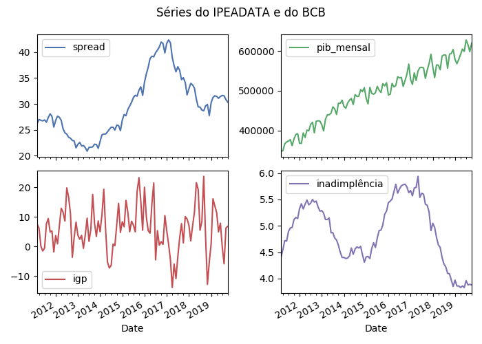

.. seriesbr documentation master file, created by
   sphinx-quickstart on Sun Dec 15 17:06:03 2019.
   You can adapt this file completely to your liking, but it should at least
   contain the root `toctree` directive.

SeriesBR
=================================================================================

|pypi|
|downloads|
|travis|
|codecov|

**SeriesBR** is a Python package to interact with brazilian time series databases such as:

- Banco Central do Brasil (BCB)
- Instituto de Pesquisa Econômica Aplicada (IPEA)
- Instituto Brasileiro de Geografia e Estatística (IBGE)

It integrates well with ``pandas`` as almost all functions return a ``DataFrame``.

Installation
------------

Get the latest version with:

.. code::

   $ pip3 install --upgrade seriesbr

Main Features
-------------

-  Get multiple time series with ``get_series``.
-  Search in a given database with ``search``.
-  Get metadata with ``get_metadata``.

User
----

In the following links you will learn more on how to use each module:

.. toctree::
   :maxdepth: 2

   BCB <demos/BCB>
   IPEA <demos/IPEA>
   IBGE <demos/IBGE>

Developer
---------

And here you can explore the source code and its documentation:

.. toctree::
   :maxdepth: 1

   Documentation <api/modules>

Quick Demo
----------

Here's how to get series from both BCB and IPEA:

.. ipython:: python

   from seriesbr import seriesbr

   dados = seriesbr.get_series(
       {
           "spread": 20786,
           "pib_mensal": 4380,
           "igp": "PAN12_IGPDIG12",
           "inadimplência": "BM12_CRLIN12"
       },
       join="inner",
   )

   import matplotlib.pyplot as plt
   import matplotlib

   dados.plot(subplots=True, layout=(2, 2), figsize=(7, 5));
   plt.gcf().tight_layout();
   plt.suptitle("Séries do IPEADATA e do BCB");
   @savefig index.png
   plt.subplots_adjust(top=.9)

.. |pypi| image:: https://img.shields.io/pypi/v/seriesbr.svg
   :target: https://pypi.org/project/seriesbr/
.. |downloads| image:: https://img.shields.io/pypi/dm/seriesbr
    :target: https://pypistats.org/packages/seriesbr
.. |travis| image:: https://travis-ci.org/phelipetls/seriesbr.svg?branch=master
   :target: https://travis-ci.org/phelipetls/seriesbr
.. |codecov| image:: https://codecov.io/gh/phelipetls/seriesbr/branch/master/graph/badge.svg
   :target: https://codecov.io/gh/phelipetls/seriesbr

Indices and tables
==================

* :ref:`genindex`
* :ref:`modindex`
* :ref:`search`
